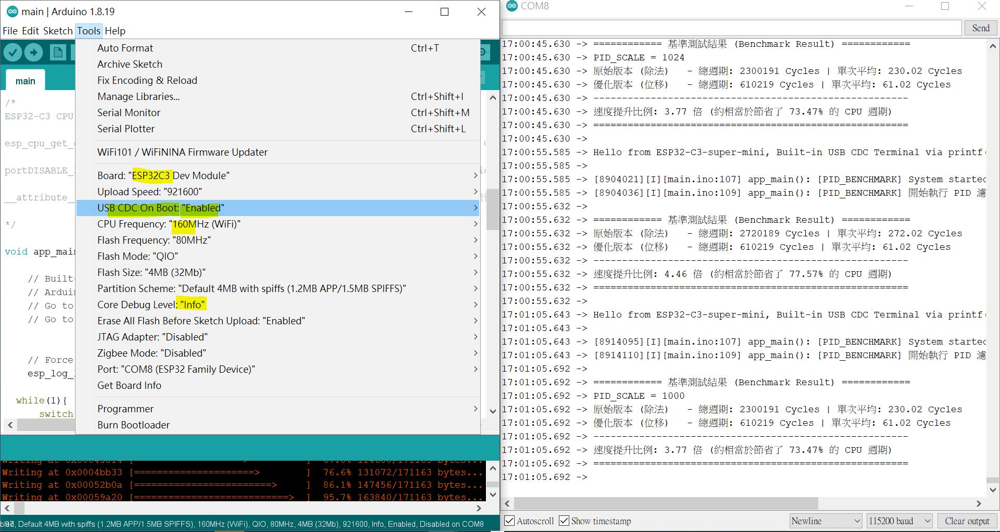
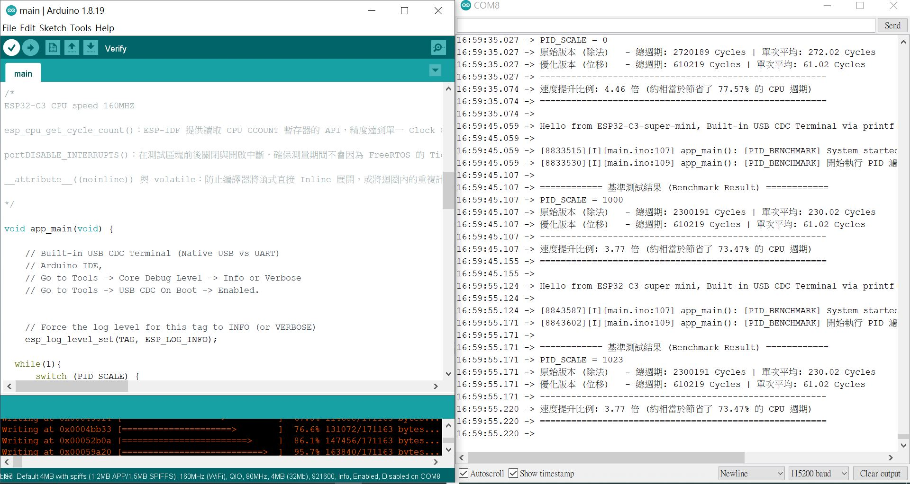
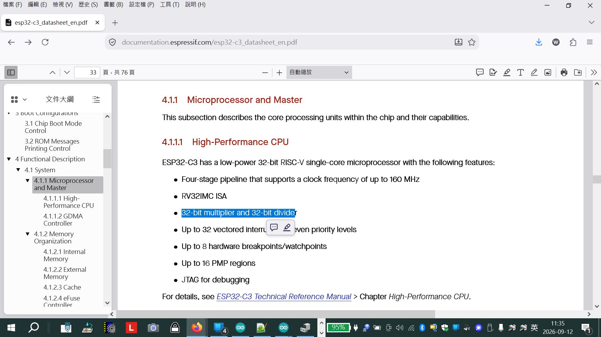

# Arduino_ESP32C3_pure_c_programming
Moving average, fixed point math algorithm benchmarking, ESP32-C3, no FPU should be.  
local project archive, D:\iphone_air_drop_photo\DIY\2026-09-06_FixMathPID\main

https://developer.espressif.com/blog/2025/10/cores_with_fpu/

### C source code
[main.ino](main.ino)  
pure C code, uses Arduino IDE to compile the code, to see whether SCALING FACTOR and performance boosting effectively with ESP32-C3, looks like promising. the testing code.

### Arduino IDE setup for ESP32-C3 and compiling  
    

### Terminal output for the testing result  
  


### datasheet, local cache   
[esp32-c3_datasheet_en.pdf](esp32-c3_datasheet_en.pdf)  
[esp32-c3_technical_reference_manual_en.pdf](esp32-c3_technical_reference_manual_en.pdf)    

### further reading  


according to ESpressive, ESP32-C3 is RISC-V and no FPU.  

FixedPID (https://github.com/citycafe578/FixedPID)  
it has routine with IIR filtering, performance with SCALE up 1000 and software division has to be with this ESP32-C3.  

https://documentation.espressif.com/esp32-c3_datasheet_en.pdf  
https://documentation.espressif.com/esp32-c3_technical_reference_manual_en.pdf#riscvcpu  


```
https://documentation.espressif.com/esp32-c3_technical_reference_manual_en.pdf#riscvcpu  
有沒有 FPU 浮點運算單元 

沒有。ESP32-C3 並沒有硬體浮點運算單元（FPU）。
以下是有關 ESP32-C3 在 CPU 與浮點運算處理上的詳細說明：
1. CPU 架構規範ESP32-C3 採用的 RISC-V 核心指令集架構（ISA）為 RV32IMC：  
RV32I：32 位元基礎整數指令集（Base Integer Instruction Set）。   
M (Extension)：硬體乘法與除法擴充（Standard Extension for Integer Multiplication and Division）。  
C (Extension)：壓縮指令擴充（Standard Extension for Compressed Instructions）。  
⚠️ 如果包含硬體浮點運算，RISC-V 的架構標籤會包含 F（單精度）或 D（雙精度），例如 RV32IMFC。ESP32-C3 並不包含 F 或 D 擴充指令集。  

2. 在 ESP32-C3 上執行浮點數計算的影響
當你在 ESP32-C3 上編寫 float 或 double 變數運算時：
軟體模擬（Software Emulation）：編譯器（GCC/Clang）會自動調用軟體庫（如 libgcc）來模擬浮點運算。
效能差異：軟體模擬浮點運算需要耗費數十至上百個 CPU 週期，比硬體 FPU 或整數運算慢許多。

3. ESP32 系列的 FPU 支援對照若你的專案對浮點運算或 DSP 有較高即時性要求，
可參考 Espressif 晶片的 FPU 配備情況：
晶片型號CPU 架構硬體 FPU 支援
ESP32-C3RISC-V❌ 無（純軟體模擬）
ESP32-C2 / C6RISC-V❌ 無
ESP32-P4RISC-V2x（單精度 / 雙精度 FPU）
ESP32 (經典款)Xtensa LX62x（僅單精度 float）
ESP32-S3Xtensa LX72x（僅單精度 float，帶矢量/DSP 擴充）

```


### 32-bit multiplier and 32-bit divider 代表啥意思 
  

```
https://documentation.espressif.com/esp32-c3_datasheet_en.pdf

32-bit multiplier and 32-bit divider 代表啥意思 

在 ESP32-C3 上開發時，樂鑫官方（Espressif）建議：  
儘量避開 float / double：能用整數（Integer）解決的運算，優先使用整數。
改用定點數（Fixed-point arithmetic）：例如將單位放大 1000 倍（以毫伏 mV 取代伏特 V、以微安 uA 取代安培 A），保持在整數運算範圍內。

代表 ESP32-C3 擁有硬體層面的 32 位元整數乘法器與除法器（在 RISC-V 架構中對應 M 擴充指令集）。

這意味著 CPU 在處理整數的乘法與除法運算時，不需要靠軟體寫演算法慢慢算，而是能在幾個 CPU 週期內直接由專屬硬體電路完成。
詳細運算機制與影響

32-bit Multiplier（32 位元乘法器）：  
支援 32 位元整數與 32 位元整數直接相乘。在硬體指令下（如 mul、mulh），能直接計算出 32 位元或 64 位元（高低位元拆分）的結果。  

32-bit Divider（32 位元除法器）：  
支援 32 位元整數除法與求餘數（如 div、rem 指令），硬體會自動處理有符號（Signed）與無符號（Unsigned）整數的除法。  

軟體模擬 vs. 硬體算術單元
如果晶片沒有硬體乘除法器，CPU 在執行 a * b 或 a / b 時，編譯器必須插入長達數十到數百個運算步驟（例如使用「移位與加法/減法」迴圈）來模擬運算。

有無硬體乘除法器的效能差異：
加法 / 減法：1 個 CPU 週期（基本算術邏輯單元 ALU 即可完成）。
硬體乘法：通常僅需 1 ~ 3 個 CPU 週期。
硬體除法：通常需要 8 ~ 30 個 CPU 週期（除法在硬體設計上天生較複雜）。

純軟體模擬除法：可能耗費 100+ 個 CPU 週期。

為什麼要有這個？（特別是在沒有 FPU 的情況下）

ESP32-C3 沒有硬體浮點運算單元（FPU），所有 float 運算都必須靠軟體模擬。

為了補足這點，ESP32-C3 提供強大的 32 位元硬體乘除法器，讓開發者能夠使用定點數（Fixed-Point Arithmetic）或放大倍率的整數演算法，來實現高速、低延遲的數學計算（如 PID 控制、濾波演算法、PWM 調光計算等），同時保持極高的執行效率與低功耗。  
```


### benchmarking
pure C code, uses Arduino IDE to compile the code, to see whether SCALING FACTOR and performance boosting effectively with ESP32-C3, looks like promising. the testing code,

```
// xiao_laba_cn@yahoo.com, 2026-SEP-06
// orignal code snippet, https://github.com/citycafe578/FixedPID/blob/main/src/FixedPID.cpp
// int64_t FixedPID::filterDerivative(int64_t rawD){}

#include <stdio.h>
#include "freertos/FreeRTOS.h"
#include "freertos/task.h"
#include "esp_cpu.h"
#include "esp_log.h"

//#include <unistd.h> // Included for sleep() to slow down execution

static const char *TAG = "PID_BENCHMARK";

//ESP32 C3, RISC-V and no FPU available
//#define PID_SCALE 0x3FF // 0~1023
#define PID_SHIFT 10


// 全局變數（加上 volatile 避免編譯器將重複運算直接優化優掉）
volatile int64_t alpha = 1024;
volatile int64_t rawD_test = 1024;
volatile int64_t prevD_1 = 500;
volatile int64_t prevD_2 = 500;


volatile uint16_t PID_SCALE = 0;


// read about, https://developer.espressif.com/blog/2025/10/cores_with_fpu/
// 1. 原始版本（64位元除法 + 2次乘法, FPU used ?? ESP32-C3 no FPU
__attribute__((noinline)) int64_t filterDerivative_Original(int64_t rawD) {
    if (alpha == PID_SCALE) {
        return rawD;
    }
    int64_t filteredD =
        ((int64_t)alpha * rawD +
         (PID_SCALE - (int64_t)alpha) * prevD_1) / PID_SCALE;

    prevD_1 = filteredD;
    return filteredD;
}

// 2. 優化版本（64位元位移 + 1次乘法）
__attribute__((noinline)) int64_t filterDerivative_Optimized(int64_t rawD) {
    if (alpha == PID_SCALE) {
        return rawD;
    }
    int64_t filteredD = prevD_2 + (((int64_t)alpha * (rawD - prevD_2)) >> PID_SHIFT);

    prevD_2 = filteredD;
    return filteredD;
}


/*
ESP32-C3 CPU speed 160MHZ

esp_cpu_get_cycle_count()：ESP-IDF 提供讀取 CPU CCOUNT 暫存器的 API，
精度達到單一 Clock Cycle（在 240MHz ??? 時鐘下，1 cycle = 4.16 ns）。

portDISABLE_INTERRUPTS()：在測試區塊前後關閉與開啟中斷，確保測量期間不會
因為 FreeRTOS 的 Tick 中斷或任務調度而產生計數偏差。

__attribute__((noinline)) 與 volatile：防止編譯器將函式直接 Inline 展開，或將迴圈內的重複
計算在編譯期進行常量折疊（Constant Folding）優化，從而確保測量到的是真實的指令執行週期。

*/

void app_main(void) {
  
    // Built-in USB CDC Terminal (Native USB vs UART)
    // Arduino IDE,
    // Go to Tools -> Core Debug Level -> Info or Verbose
    // Go to Tools -> USB CDC On Boot -> Enabled.
    
    
    // Force the log level for this tag to INFO (or VERBOSE)
    esp_log_level_set(TAG, ESP_LOG_INFO);
  
  while(1){
      switch (PID_SCALE) {
              case 0:
                  // Handles case when PID_SCALE is initially 0
                  PID_SCALE = 1000;
                  break;     
              case 1000:
                  PID_SCALE = 0x3FF; // 1023 in decimal
                  break;
              case 1023:
                  PID_SCALE = 1024; // 1023 in decimal
                  break;
              case 1024:
                  PID_SCALE = 0;
                  break;                      
              default:
                  PID_SCALE = 0;
                  break;
          }
    
    //vTaskDelay(pdMS_TO_TICKS(1000)); // 等待系統日誌穩定

    vTaskDelay(pdMS_TO_TICKS(10000)); // and delay to easy naked eyes to visual terminal log

    const uint16_t iterations = 1000;
    uint32_t start_cycles, end_cycles;
    uint32_t cycles_orig = 0, cycles_opt = 0;

    // Standard C library print
    printf("Hello from ESP32-C3-super-mini. Built-in USB CDC Terminal via printf()!\n\n");

    // ESP-IDF Logging System (Recommended)
    ESP_LOGI(TAG, "System started successfully, by ESP_LOGI(TAG)");
    
    ESP_LOGI(TAG, "開始執行 PID 濾波器基準測試 (%d 次迭代)..., ESP_LOGI(TAG)", iterations);

    // --- 1. 測試原始版本 ---
    portDISABLE_INTERRUPTS(); // 關閉中斷以防 context switch 影響計數
    start_cycles = esp_cpu_get_cycle_count();
    for (int i = 0; i < iterations; i++) {
        filterDerivative_Original(rawD_test + i);
    }
    end_cycles = esp_cpu_get_cycle_count();
    portENABLE_INTERRUPTS();
    cycles_orig = end_cycles - start_cycles;

    // --- 2. 測試優化版本 ---
    portDISABLE_INTERRUPTS();
    start_cycles = esp_cpu_get_cycle_count();
    for (int i = 0; i < iterations; i++) {
        filterDerivative_Optimized(rawD_test + i);
    }
    end_cycles = esp_cpu_get_cycle_count();
    portENABLE_INTERRUPTS();
    cycles_opt = end_cycles - start_cycles;

    // --- 計算結果 ---
    float avg_orig = (float)cycles_orig / iterations;
    float avg_opt = (float)cycles_opt / iterations;
    float speedup = ((avg_orig - avg_opt) / avg_orig) * 100.0f;
    float ratio = avg_orig / avg_opt;

    printf("\n============ 基準測試結果 (Benchmark Result) ============\n");
    printf("PID_SCALE = %d\n", PID_SCALE);
    printf("原始版本 (除法)   - 總週期: %" PRIu32 " Cycles | 單次平均: %.2f Cycles\n", cycles_orig, avg_orig);
    printf("優化版本 (位移)   - 總週期: %" PRIu32 " Cycles | 單次平均: %.2f Cycles\n", cycles_opt, avg_opt);
    printf("-------------------------------------------------------\n");
    printf("速度提升比例: %.2f 倍 (約相當於節省了 %.2f%% 的 CPU 週期)\n", ratio, speedup);
    printf("=======================================================\n\n");

  }

}


/*
  use ardiuino IDE esp32 compiler, this is a must of two dummy functions to be included.
  otherwise compile time error as following,
C:/Users/user0/AppData/Local/Arduino15/packages/esp32/tools/esp-rv32/2507/bin/../lib/gcc/riscv32-esp-elf/14.2.0/../../../../riscv32-esp-elf/bin/ld.exe: C:\Users\user0\AppData\Local\Temp\arduino_build_280741\core\core.a(main.cpp.o): in function `loopTask(void*)':
C:\Users\user0\AppData\Local\Arduino15\packages\esp32\hardware\esp32\3.3.2\cores\esp32/main.cpp:58:(.text._Z8loopTaskPv+0x26): undefined reference to `setup()'
C:/Users/user0/AppData/Local/Arduino15/packages/esp32/tools/esp-rv32/2507/bin/../lib/gcc/riscv32-esp-elf/14.2.0/../../../../riscv32-esp-elf/bin/ld.exe: C:\Users\user0\AppData\Local\Arduino15\packages\esp32\hardware\esp32\3.3.2\cores\esp32/main.cpp:71:(.text._Z8loopTaskPv+0x4a): undefined reference to `loop()'
collect2.exe: error: ld returned 1 exit status
exit status 1
Error compiling for board ESP32C3 Dev Module.

*/

// Arduino C code and the start up function
void setup(){
  app_main(); // call blinking function
}
void loop(){
}
```
